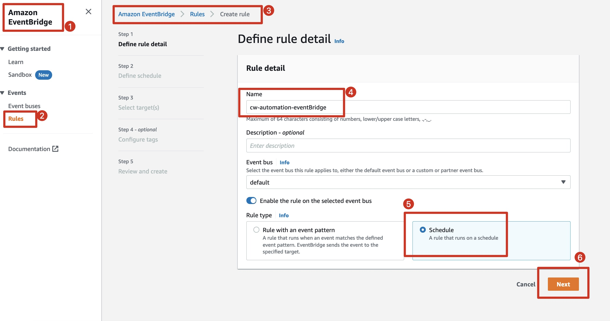

# Cloudwatch_Baseline_Alarm_Automation

>此方案目的为了协助运维工程师在 AWS 上能快速建立服务监控基线

### 架构图

### 方案说明
#### 功能实现

1. 自动化批量创建 AWS Cloudwatch 指标告警（当前项目先提供 EC2、ElastiCache、RDS 的样例代码，后续会按需逐步更新常用服务）
2. 服务发现，自动添加新增服务（实例）的告警
3. 自定义告警通知信息
4. 接入飞书/微信/钉钉/Slack/其他 Webhook 端（本样例采用飞书作为演示）

#### 逻辑实现

告警自动化部分：

1. 设计每项托管服务对应一个 Lambda 进行服务发现、新增告警、删除失效告警工作
2. Cloudwatch EventBridge 定期触发 Lambda 进行扫描工作
3. 告警触发后会统一归集到 SNS 进行后续自定义格式

自定义告警部分：

1. SNS 作为 Lambda的事件触发源，触发 Lambda 进行告警信息格式自定义
2. Lambda 读取 SNS 中的告警信息，并进行格式化
3. 格式化后的信息发送到 SNS
4. SNS 作为 Lambda的事件触发源，触发 Lambda 调用飞书/微信/钉钉/Slack/其他 Webhook 端 API，发送告警通知

### 指标说明

1. EC2：实例 CPU（百分比）
2. ElastiCache：Redis 引擎 CPU（百分比）、Redis 引擎占用内存（百分比）
3. RDS：实例 CPU（百分比）、实例可用内存（容量）、实例可用存储（容量）、数据库连接数

### 部署步骤

>本项目采取从右往左的部署顺序

#### 告警通知方案部署

告警通知方案已提供快速一键部署方式，详细部署步骤参考链接：

https://github.com/Chris-wa-He/AWS-Lambda-notifier/tree/Feishu-notifier

部署完成后将资源创建的 SNS ARN 记录下来

#### 告警自动化方案部署

1. 创建一个 Lambda 执行角色（IAM ROLE），供后面部署的 Lambda 使用

>此方案中 Lambda 作为内网环境中运行，在部署初期为了快速验证效果，可以先分配admin权限，待方案全流程打通后建议已最小权限原则按需分配权限

>点击创建角色后完成 Lambda执行角色的创建

2. 部署 Lambda，实现消息格式自定义

创建后把路径 [Lambda_Alarm_Format_Cx](https://github.com/jerrywonggithub/Cloudwatch_Baseline_Alarm_Automation/tree/main/Lambda_Alarm_Format_Cx)/lambda-cx-msg.py 的代码复制并覆盖到 code 页面上，点击 Deploy 进行代码部署

修改运行超时时间（建议设置为1分钟或5分钟）

添加环境变量（Key：NotificationSNSTopicARN，**Value：<填写告警通知方案部署中最后记录的ARN>** ）

3. 额外创建一个 SNS，作为原始告警信息的事件总线

>选择Standard 类型，填写topic名字之后，其他配置保留默认即可，点击创建后**并记录 ARN**

创建订阅（选择 Lambda 作为协议类型，然后选择上一步创建完成的 Lambda：lambda-customize-msg）

4. 上传依赖包

将本项目需要用到的依赖包：**requests.zip** 下载下来

先上传依赖包，为后续每个 Lambda 的部署工作服务

5. 部署告警自动化代码

创建后把路径 **/**[**Lambda_EC2_baseline**](https://github.com/jerrywonggithub/Cloudwatch_Baseline_Alarm_Automation/tree/main/Lambda_EC2_baseline)**/lambda-ec2.py** 的代码复制并覆盖到 code 页面上，点击 Deploy 进行代码部署

导入依赖包

修改运行超时时间（建议设置为1分钟或5分钟）

添加环境变量
>为了铺开告警指标的部署，建议 MaxItems 值设为1000或者更高
>SNS_topic_ARN填写在第三步创建SNS的ARN

6. 后续 ElastiCache、RDS Lambda 的部署均与上面步骤5相同，分别将下图文件夹中的Python代码部署一遍即可

7. 配置 Amazon EventBridge 

>注意：应为每个告警自动化的 lambda 创建一个定时规则，此处不再重复演示
>至此，已完成本项目的全流程部署

### 测试验证

#### 告警自动化 Lambda 代码可执行性验证

#### 飞书客户端通知信息

